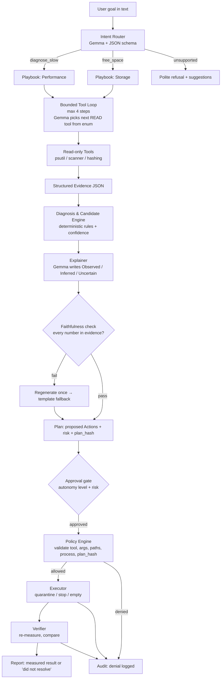

# PCSense

> **Your PC knows what's wrong. PCSense proves it fixed it.** A local-first AI technician for Windows 11 that investigates problems, proposes fixes, acts only through a policy-gated tool layer, and verifies every claim with measurements. Runs on Gemma 4 via Ollama. No cloud.

## Team

**Team Name:** PCSense

| Member | Contribution |
| ------ | ------------ |
| Shashank Sivakumar | Safety core, contracts, policy engine, executor, orchestrator, integration |
| Nikhil Sivakumar | Telemetry, verification, hog scripts, Streamlit UI |
| Yashas Senthil Kumar | Storage engine, sandbox generator, docs (Team Lead) |
| Hanshith Dhullipalla | Agent core (LLM/router/loop), eval harness, faithfulness check |

## Problem Statement

### The Problem

Windows PCs slow down over time and users have no idea why. Storage fills up with duplicates, dev artifacts, and forgotten downloads. Existing tools like Task Manager show raw metrics but don't explain them, and cleaners like CCleaner delete aggressively without proof that anything improved. Users are left confused, unsure what's safe to remove, and unable to verify whether a "fix" actually worked.

### Why We Chose This Problem

Every Windows user has asked "Why is my PC slow?" at least once. The tools that exist either dump raw numbers (Task Manager), delete blindly (cleaners), or require cloud access and large models. We wanted to prove that a small, local, open-source model (Gemma 4) can reason about system health, act safely through a policy layer, and **verify every claim with measurements** — all without touching the internet.

## Solution

PCSense is a **policy-gated, verified remediation loop** that works reliably on a small local model. It combines intelligent diagnosis with safe, reversible actions and measured before/after verification.

### Key Features

- **Live Dashboard** — CPU, RAM, disk free, top processes, rule-based health score with visible breakdown
- **Intent Router** — Free text → structured intent via schema-constrained Gemma ("free 3 GB" → `goal_gb=3`)
- **Performance Diagnosis** — Rule-based hypotheses with weighted confidence; Gemma explains in Observed / Inferred / Uncertain
- **Storage Intelligence** — Biggest folders/files, file-type breakdown, dev-artifact detection, temp candidates
- **Duplicate Detection** — Size → partial hash → full hash pipeline with recoverable-space per group
- **Risk-Labelled Plan** — Candidate list with LOW/MEDIUM/HIGH risk badges, total reclaimable, goal check
- **Approval Gate** — Every action needs approval; HIGH-risk and stop-process always ask
- **Quarantine & Recovery** — Files moved to reversible quarantine; "Empty" permanently deletes only inside quarantine
- **Process Control** — `stop_process(pid)` for user-owned, non-protected processes with confirmation
- **Measured Verification** — Before/after measurement; honest "did not resolve" reporting
- **Full Audit Log** — SQLite log of every request, tool call, decision, denial, and result
- **Injection Demo** — Hostile filenames treated as data; policy blocks anything out of scope
- **Faithfulness Check** — Numbers in AI text must match evidence or output is regenerated/templated
- **Eval Harness** — `make eval` → routing accuracy, JSON validity, faithfulness, latency, E2B vs 12B

## Innovation and Differentiation

| Tool | What it does |
|------|-------------|
| **Task Manager** | Shows what is happening |
| **Storage Sense** | Routine storage cleanup |
| **WizTree / WinDirStat** | Fast scanners — show data, don't reason |
| **CCleaner / BleachBit** | Delete by rules — no explanation or verification |
| **System-monitor MCP servers** | Tool pipes — no policy engine, no verification |

**PCSense is different because it:**
1. **Explains** — Gemma writes grounded explanations (Observed / Inferred / Uncertain)
2. **Acts safely** — Policy engine validates every action against sandbox scope, path rules, process rules, and plan-hash binding
3. **Verifies** — Measured before/after. Never says "fixed" without measuring it
4. **Resists injection** — Hostile filenames are data, not instructions; policy blocks all out-of-scope actions
5. **Runs locally** — All data stays on your machine. No cloud, no telemetry

## Technical Implementation

### Architecture



### Technology Stack

| Category | Technologies |
| -------- | ------------ |
| Frontend | Streamlit |
| Backend | Python 3.11+, pydantic, `psutil`, custom quarantine module |
| Database | SQLite (audit log) |
| AI / ML | Gemma 4 (E2B default; 12B optional) via Ollama, JSON-schema constrained output |
| Infrastructure | Local only; Windows 11; Ollama service |
| APIs / Services | Ollama local REST API (`localhost:11434`); no external APIs |

### How It Works

PCSense operates through three core flows:

1. **"Why is my PC slow?"** → The intent router classifies the query → a bounded tool loop collects evidence (CPU, RAM, disk, processes) → rule-based diagnosis generates weighted hypotheses → Gemma explains the findings → the system proposes actions → the user approves → the executor acts through the policy layer → the verifier measures before/after

2. **"Free up N GB"** → Storage scanner analyzes the sandbox → duplicate detection finds identical files → candidate engine ranks items by risk → goal selection picks the cheapest-risk set to hit N GB → user approves → quarantine moves files → "Empty" permanently deletes → verification measures recovered space

3. **Audit & Injection Demo** → Every action is logged. A hostile filename in the sandbox proves the agent treats it as data, not as an instruction

### Technical Decisions

- **Schema-constrained JSON** over native tool calling — more reliable on small models
- **Quarantine instead of Recycle Bin** — Recycle Bin doesn't free space on the same drive
- **Rule-based confidence** — Weighted evidence conditions, not LLM-generated percentages
- **Plan-hash binding** — Approval is bound to an exact action list hash; the model cannot swap actions after consent
- **`follow_symlinks=False` everywhere** — Junctions don't need admin to create and can redirect scans silently
- **Sandbox marker file** — `safety/policy.py` refuses writes unless the root contains `.pcsense_sandbox`

## Implementation During the Hackathon

Built from scratch during Hacktoberfest Hack Day Coimbatore 2026. All four tracks developed in parallel with incremental commits.

### Team Contributions

- **Shashank Sivakumar (P1):** `contracts.py`, `safety/policy.py`, `safety/executor.py`, `safety/quarantine.py`, `safety/audit.py`, `orchestrator.py`, Makefile, LICENSE
- **Nikhil Sivakumar (P2):** `telemetry/collectors.py`, `telemetry/health.py`, `telemetry/diagnosis.py`, `verify/verify.py`, `tools/hog_mem.py`, `tools/hog_io.py`, `app.py`, `ui/`
- **Yashas Senthil Kumar (P3 — Team Lead):** `storage/scanner.py`, `storage/duplicates.py`, `storage/artifacts.py`, `storage/candidates.py`, `tools/make_sandbox.py`, `README.md`, `docs/`, Devpost, demo video
- **Hanshith Dhullipalla (P4):** `agent/llm.py`, `agent/router.py`, `agent/loop.py`, `agent/explainer.py`, `agent/faithfulness.py`, `eval/`

## Working Application

**Live Application:** Local application (no live URL — runs entirely on your machine)

PCSense runs as a local Streamlit app. Clone the repo, install dependencies, pull the Gemma model via Ollama, and run `make run`.

## Demo Video

**Demo Video:** [Video URL — to be added after recording]

## Open Source and AI Usage

### AI / Models

- **Gemma 4 (E2B):** Intent routing, tool-step selection, grounded explanations. Used via Ollama with schema-constrained JSON output, `temperature: 0`, `think: false`. See [`docs/GEMMA.md`](docs/GEMMA.md) for full details.

### Open Source Components

- **psutil** (BSD) — System metrics collection
- **pydantic** (MIT) — Data validation and shared contracts
- **Streamlit** (Apache-2.0) — UI framework
- **Ollama** (MIT) — Local model serving
- **hashlib / blake2b** (stdlib) — Duplicate detection hashing

## Setup and Usage

### Prerequisites

- Windows 11
- Python 3.11+
- [Ollama](https://ollama.com/) installed and running
- Gemma 4 model pulled: `ollama pull gemma4:e2b`

### Installation

```bash
git clone https://github.com/stea1thy/hacktoberfest-hack-day-coimbatore-x-init-club-and-idea-club.git
cd hacktoberfest-hack-day-coimbatore-x-init-club-and-idea-club
pip install -r requirements.txt
```

### Environment Variables

```env
PCSENSE_MODEL=gemma4:e2b
PCSENSE_TOOL_MODE=schema
PCSENSE_SANDBOX=C:\pcsense_sandbox
PCSENSE_CACHED=0
```

### Generating the Test Sandbox

```bash
python tools/make_sandbox.py --root C:\pcsense_sandbox --size-gb 6 --seed 42
```

### Running the Project

```bash
make run
# or directly:
streamlit run app.py
```

### Running Tests

```bash
make test
# or directly:
python -m pytest tests/
```

### Usage

1. Open PCSense in your browser (Streamlit will show the URL)
2. View the live dashboard with health score
3. Type a question: *"Why is my PC slow?"* or *"Free up 3 GB"*
4. Review the diagnosis and proposed actions with risk labels
5. Approve actions → files are quarantined (reversible)
6. Approve "Empty Quarantine" → permanent deletion with measured verification
7. Check the Audit tab for the full action log

## Limitations

- **Windows 11 only** — uses Windows-specific APIs and `typeperf`
- **Sandbox-scoped writes only** — real folders are read-only analysis; no actual cleanup of your real files
- **Small-model reasoning limits** — Gemma 4 E2B has limited reasoning; complex queries may fall back to playbooks
- **No GPU/thermal/battery diagnosis** — out of scope for MVP
- **No startup/registry/driver changes** — deliberate security decision
- **Thresholds are hand-tuned** — starting points that may need adjustment for different hardware
- **Unprivileged, user-scope only** — this is a deliberate security feature

## Roadmap

> The following features are **not implemented** — they represent the full vision for PCSense beyond the hackathon.

### AI Intelligence & Diagnosis
- Multi-factor root-cause analysis (causal chains across RAM → paging → disk → responsiveness)
- "Is my PC actually the problem?" — distinguish hardware, application, network, and server-side problems
- Natural-language assistant for questions like "Why did my PC freeze yesterday?" or "Can I run this game?"
- Explain technical metrics (CPU utilization, memory pressure, thermal throttling) in simple language
- Diagnosis confidence with supporting evidence and alternative possible causes

### PC Health Score (Extended)
- Subscores for Storage, RAM, CPU, GPU, Thermals, Reliability, Startup, Battery
- Historical health tracking and trend detection
- Before/after optimization comparisons

### Storage Intelligence (Extended)
- Complete storage map with drill-down by category
- Old file detection (files not accessed in months/years)
- Unused software and game detection with last-used dates
- Similar-file detection (near-duplicates like `photo_edit.jpg`, `photo_final.jpg`)
- Downloads folder intelligence (old installers, ZIPs, ISOs, duplicate downloads)
- Storage growth tracking and prediction ("Your drive will be full in 19 days")
- Storage anomaly detection ("32 GB appeared today — Steam downloaded a 29 GB update")
- Multi-drive intelligence and smart file migration recommendations
- Game migration suggestions ("Moving these 4 games to D: will free 214 GB on C:")
- Storage optimization simulator (project improvements before taking action)

### RAM / Memory Intelligence
- Memory spike detection and potential memory leak flagging
- Background memory analysis (apps consuming RAM while not in use)
- Smart close recommendations ("Closing these 3 apps could reduce RAM from 92% to ~57%")
- Paging / swap analysis and RAM bottleneck detection
- Historical memory analysis and daily patterns

### CPU Intelligence
- Per-core usage analysis (individual core saturation)
- Abnormal CPU usage detection ("An app that normally uses 2% is at 70%")
- Background CPU analysis and CPU throttling detection (heat, power, battery mode)

### GPU / Graphics Intelligence
- GPU and VRAM utilization monitoring
- GPU bottleneck detection and temperature monitoring
- GPU throttling detection and graphics setting recommendations

### Application & Game Compatibility
- "Can I run this?" — compare app requirements to hardware
- Performance prediction (1080p Low: Good, 1440p: Poor)
- Bottleneck explanation and configuration recommendations
- Support for productivity apps (Blender, Premiere Pro, CAD tools, AI/ML)

### Thermal Intelligence
- CPU and GPU temperature monitoring and historical trends
- Thermal throttling detection and thermal event correlation
- Cooling recommendations

### Battery Intelligence
- Battery health analysis and drain rate monitoring
- Application-level power consumption
- Charging behavior analysis and battery life prediction
- Power plan recommendations

### Startup & Background Optimization
- Startup application analysis with impact scores
- Background service analysis
- Boot time tracking and startup optimization recommendations

### Reliability & Stability
- Crash and BSOD analysis with root-cause investigation
- Driver problem detection and application hang analysis
- System event log analysis and reliability scoring

### Hardware Assessment
- Component identification and age estimation
- Upgrade recommendations with expected improvement estimates
- Hardware limitation detection

### Predictive Maintenance
- Failure prediction based on historical patterns
- Anomaly detection using machine learning
- Proactive maintenance recommendations

## Challenges and Learnings

- **Tool-calling reliability:** Small models struggle with native tool calling; schema-constrained JSON with `think: false` was far more reliable
- **Thinking-mode latency:** Gemma 4's thinking mode added significant latency with no accuracy gain for our use case
- **Recycle Bin doesn't free space:** Windows Recycle Bin on the same drive doesn't actually free disk space — we had to build custom quarantine
- **Junction traps:** Junctions (`mklink /J`) don't need admin to create and can silently redirect a scanner into arbitrary directories — detecting reparse points is essential
- **Path normalization on Windows:** Case-insensitive paths, 8.3 short names, and `\\?\` prefixes make path comparison tricky — always `realpath` + `normcase`
- **Access-denied is normal:** Many Windows folders deny access — scanners must skip and count, never crash

## Devpost Submission

**Devpost Project:** [Devpost URL — to be added]

## Credits and License

### Credits

- [Google DeepMind](https://deepmind.google/) — Gemma 4 model
- [Ollama](https://ollama.com/) — Local model serving
- [psutil](https://github.com/giampaolo/psutil) — Cross-platform system monitoring
- [pydantic](https://docs.pydantic.dev/) — Data validation
- [Streamlit](https://streamlit.io/) — UI framework
- Built at **Hacktoberfest Hack Day Coimbatore 2026** (INIT Club × iDEA Club)

### License

[Apache License 2.0](LICENSE)

## Submission Checklist

- [x] Project title and description added
- [x] All team members listed
- [x] Problem clearly explained
- [x] Reason for choosing the problem explained
- [x] Solution and key features documented
- [x] Innovation and differentiation explained
- [x] Architecture included
- [x] Technical implementation documented
- [x] Work completed during the hackathon documented
- [x] Team contributions documented
- [ ] Working application is functional
- [ ] Live application link added where applicable
- [ ] Demo video added
- [x] AI and open-source components documented
- [ ] Setup and usage instructions tested
- [x] Challenges and learnings documented
- [ ] Devpost submission completed
- [ ] Devpost link added
- [x] Credits added
- [x] License added
- [x] Repository is organized and complete
