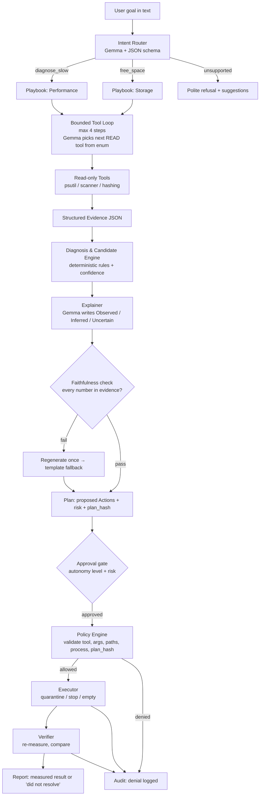

# PCSense

> Task Manager tells us what's happening. PCSense tells you why, and resolves it.

A local-first AI technician for Windows 11 that investigates PC problems, proposes fixes,
acts only through a policy-gated tool layer, and **verifies every claim with measurements**.
Runs on Gemma 4 via Ollama. No cloud.

## Team

**Team Name:** YVL

| Member | Contribution |
| ------ | -------------- |
| Shashank Sivakumar | Team Lead; repo setup, skeleton coordination |
| Nikhil Sivakumar | Safety core (policy engine, quarantine, executor, audit log), orchestrator, multi-factor diagnosis, what-if simulator, session report, integration |
| Yashas Senthil Kumar | Telemetry/storage tracks |
| Hanshith Dhullipalla | Agent core: Ollama-backed intent router, bounded tool-selection loop, explainer, faithfulness checker |

*(Contribution notes above are drawn from commit history at submission time — double-check and adjust if they don't match how the work actually split.)*

## Problem Statement

### The Problem

When a Windows PC slows down, fills up, or starts acting unpredictably, the average
user has no real way to find out why. Task Manager shows numbers without explanation.
Traditional "optimizer" and cleaner tools go the other direction — they delete files or
change settings with one click and a vague promise that it helped, with no evidence and
no way to know if anything actually improved. Users are left either staring at raw
telemetry they can't interpret, or trusting a black box that silently touches their files.

### Why We Chose This Problem

Every one of us has hit the same wall: a PC "feels slow" and the only real options are
blindly running a cleaner, googling scary-sounding error codes, or just living with it.
We wanted to build something that reasons about *why* a problem is happening instead of
just reacting to one metric, that never changes anything without permission, and that
proves — with a real before/after measurement — whether a fix actually worked. That
combination (diagnosis + safety + verification) is the part no existing tool does well.

## Solution

PCSense is a local-first AI technician. Gemma 4 (via Ollama) interprets what the user is
asking, picks the next read-only diagnostic tool to run, and writes plain-language
explanations of what the evidence shows. It **never** touches the machine directly.
Deterministic, rule-based code does all of the diagnosis logic, risk classification, and
every actual system change — and every change goes through a policy engine that can deny
it, a quarantine system that can undo it, and a verifier that measures whether it helped.

```
OBSERVE → DIAGNOSE → EXPLAIN → PROPOSE → SIMULATE → APPROVE → ACT → VERIFY
```

### Key Features

- **Natural-language request routing** — free text ("why is my pc slow", "free up 3 gb")
  routed to a structured intent via Gemma 4, with a deterministic keyword baseline as a
  fallback if the model is unavailable or returns something invalid.
- **Multi-factor diagnosis** — ranks rule-based hypotheses by confidence and splits them
  into a primary cause, weaker secondary contributors, and plain-language notes about
  metrics that are elevated but *not* actually a problem (so a busy GPU during a game
  doesn't get flagged as an error).
- **What-if simulator** — before anything is approved, predicts the effect of the
  proposed fix (e.g. "RAM: 62% → approximately 41%") from the same evidence the diagnosis
  used.
- **Policy-gated approval workflow** — three autonomy levels (Observe / Ask / Auto-low-risk)
  control what can run without a human clicking approve; stopping a process or emptying
  quarantine always requires explicit approval, at every level.
- **Reversible cleanup, not deletion** — files move to a quarantine folder first
  (restorable) and are only permanently deleted on a second, explicit approval.
- **Full audit trail** — every request, tool call, policy decision, denial, and result is
  logged to SQLite and readable back out.
- **Faithfulness checking** — every number the AI states in an explanation is checked
  against the real evidence; a mismatch triggers a deterministic template fallback instead
  of letting a hallucinated number through.
- **Injection-resistant by design** — a hostile filename or process name is data that
  flows through a delimited field, never an instruction; the policy engine's checks apply
  regardless of what the model is told to do.
- **End-of-session report** — tallies requests handled, actions taken/denied, bytes
  recovered, and fixes verified, from the real audit log.

## Innovation and Differentiation

PCSense doesn't claim to be the first tool that touches any of these individual ideas —
it claims to be the first to combine them into one trustworthy loop, on a small local model:

- **Windows 11's Settings agent** (Copilot+ PCs) only finds/changes *settings*, with no
  storage/process diagnosis and no verify loop.
- **System-monitor MCP servers** expose read tools to an AI client but have no policy
  engine, no verification, and usually assume a large capable external model.
- **WizTree / WinDirStat / TreeSize, czkawka / dupeGuru, BleachBit / CCleaner, Task
  Manager / Process Explorer** all show data or delete by fixed rules. None of them
  reason about root cause, explain their confidence, or prove the outcome.

**Our claim:** a policy-gated, verified remediation loop that works reliably on a small
local model, with measured before/after, a full audit trail, and injection-resistant
design — *"PCSense never says it fixed something until it has measured it."*

## Technical Implementation

### Architecture



### Technology Stack

| Category        | Technologies                |
| --------------- | --------------------------- |
| Frontend        | Streamlit |
| Backend         | Python 3.11+, pydantic, psutil, custom quarantine module (no Recycle Bin) |
| Database        | SQLite (audit log) |
| AI / ML         | Gemma 4 (`gemma4:e2b`) via Ollama, JSON-schema constrained output |
| Infrastructure  | Local only; Windows 11; Ollama service |
| APIs / Services | Ollama local REST API (`localhost:11434`); no external APIs |

### How It Works

1. **Router** — free text goes to Gemma with a JSON schema constraining it to one of six
   intents (`diagnose_slow`, `free_space`, `explain_storage`, `what_changed`, `status`,
   `unsupported`) plus extracted params (e.g. `goal_gb`). Falls back to a keyword matcher
   if Ollama is unreachable or returns invalid output.
2. **Evidence** — a telemetry snapshot (CPU/RAM/disk/top processes) is collected directly;
   a separate bounded tool loop (max 4 steps) lets Gemma pick further read-only
   diagnostic tools to investigate, with a fixed playbook running first regardless.
3. **Diagnosis** — a rule table scores hypotheses (`memory_pressure`, `disk_io_saturation`,
   `cpu_bound`, `storage_pressure`) by summing the weights of conditions that are true,
   then splits the ranked list into a primary cause, secondary contributors, and
   plain-language "this is normal" notes.
4. **Explanation** — Gemma writes an Observed/Inferred/Uncertain summary from the
   evidence; a faithfulness checker verifies every number it states actually appears in
   the evidence, regenerating once and then falling back to a deterministic template if
   it still doesn't check out.
5. **Plan + simulation** — the rule engine proposes risk-labelled actions; a what-if
   simulator predicts their effect (RAM/storage deltas) before anyone approves anything.
6. **Approval + policy** — depending on autonomy level, LOW-risk actions may auto-run;
   everything else waits for explicit approval, then is re-validated against the policy
   engine and a hash of the approved action list (so the plan can't be swapped after
   consent) before anything executes.
7. **Execution + verification** — approved actions run through the quarantine/executor
   layer; the system re-measures afterward and reports honestly whether it actually
   helped, rather than assuming it did.

### Technical Decisions

- **Quarantine instead of the Recycle Bin.** The Recycle Bin doesn't free space on the
  same drive. Files move to `PCSense_Quarantine/<batch_id>/` first (reversible, a
  manifest records original paths for restore); a second explicit approval empties it.
- **Plan-hash binding.** Every approval is bound to a SHA-256 hash of the exact action
  list. The executor recomputes and compares this hash before running anything, so even
  if the model's own internal data were tampered with between proposal and approval, the
  executor refuses the whole batch rather than silently running a different plan.
- **Sandbox-only writes, with a marker file.** All destructive actions are confined to a
  sandbox root that must contain a `.pcsense_sandbox` marker file. A misconfigured
  `PCSENSE_SANDBOX` environment variable can't accidentally point deletion at a real
  folder — no marker means every write is refused.
- **Reparse-point and traversal rejection.** Every path is checked both lexically
  (rejecting `..\` traversal) and against the OS-resolved real path, and every path
  component is checked for symlinks/junctions/reparse points — a junction can't be used
  to make a path *look* safe while actually pointing outside the sandbox.
- **Schema-constrained LLM calls, not native tool-calling.** Gemma 4 is called with
  Ollama's JSON-schema `format`, `temperature: 0`, `think: false`. It can only choose from
  a fixed enum of read-only tools or write explanatory text — it cannot invent a tool,
  invent an action, or execute anything itself.
- **Everything numeric is checked against evidence.** The faithfulness checker exists so
  that a hallucinated percentage or byte count can't reach the user without being caught
  first.

## Implementation During the Hackathon

Built during the event, in order:

1. **Shared skeleton and frozen contracts** — the full repo layout and a pydantic schema
   module (`pcsense/contracts.py`) that every other module imports from, committed first
   so all tracks could build in parallel against one typed interface, with stubbed
   implementations so the app ran end-to-end from early on.
2. **Safety core** — `safety/policy.py`, `quarantine.py`, `executor.py`, `audit.py`,
   written test-first and adversarially: path traversal, junction/reparse-point traps,
   protected system paths and processes, case and 8.3-short-name tricks, a missing
   sandbox marker, and plan-hash mismatches all have dedicated tests.
3. **Orchestrator** — the single entry point tying router → evidence → diagnosis →
   explainer → plan → approval → policy → executor → verify together as a stream of
   events for the UI.
4. **Real agent core** — an Ollama-backed intent router, a bounded tool-selection loop
   with a fixed playbook plus up to 4 model-chosen steps, an LLM explainer with a
   deterministic template fallback, and a faithfulness checker that can inject and catch
   a wrong number.
5. **Multi-factor diagnosis, a what-if simulator, and an end-of-session report**, wired
   into the orchestrator and a minimal but functional Streamlit UI so the whole loop is
   actually clickable, not just unit-tested.
6. **Integration** — reconciling the agent core's real (dict/string-based) return shapes
   with the frozen pydantic contracts at the orchestrator boundary, without changing
   either side's core design.

**Still mock/stub at submission time, honestly:** the real `psutil`/`typeperf` telemetry
collectors, real storage scanning and duplicate detection, the seeded demo sandbox
(duplicate files, dev artifacts, the hostile-filename injection demo, the junction trap),
and a fully polished dashboard UI (activity feed, risk badges, audit tab) — the current
UI is a working but minimal demo of the underlying system, not the final design.

### Team Contributions

- **Nikhil Sivakumar** — repo skeleton and shared contracts; the safety core (policy
  engine, quarantine, executor, SQLite audit log) with adversarial tests; the
  orchestrator; multi-factor diagnosis classification, the what-if simulator, and the
  end-of-session report; integration of the agent core into the orchestrator.
- **Hanshith Dhullipalla** — the real agent core: Ollama-backed intent router with a
  keyword-baseline fallback, the bounded tool-selection loop, the LLM explainer with a
  deterministic template fallback, and the faithfulness checker.
- **Shashank Sivakumar** — team lead; repository setup and coordination.
- **Yashas Senthil Kumar** — telemetry/storage track.

## Working Application

**Live Application:** N/A — PCSense reads local system telemetry (via `psutil`) and the
local filesystem, so it's designed to run on the user's own machine, not as a hosted web
app. Run it locally with the steps below.

## Demo Video

**Demo Video:** _not yet recorded — to be added before submission._

## Open Source and AI Usage

### AI / Models

- **Gemma 4** (`gemma4:e2b`, served locally via Ollama): used for (1) routing free-text
  requests to a structured intent + params, (2) choosing the next read-only diagnostic
  tool in a bounded loop, and (3) writing the plain-language Observed/Inferred/Uncertain
  explanation from evidence. Gemma is schema-constrained at every call and cannot invent
  tools or actions; a faithfulness checker verifies every number it states against the
  real evidence, and a deterministic fallback (keyword router / template explainer)
  covers every point where it might fail or be unavailable.

### Open Source Components

- **Ollama** — local LLM runtime serving Gemma 4.
- **Streamlit** — the UI.
- **Pydantic** — the shared schema/validation layer (`pcsense/contracts.py`).
- **psutil** — system/process telemetry.
- **httpx** / **requests** — HTTP clients for the Ollama API.
- **pytest** — the test suite (60 tests at submission time).
- SQLite (Python standard library) — the audit log.

No datasets are used. All components above are under permissive open-source licenses
(Apache-2.0/MIT/BSD-style); none were developed by this team.

## Setup and Usage

### Prerequisites

- Windows 11
- Python 3.11+
- [Ollama](https://ollama.com) installed, with `gemma4:e2b` pulled

### Installation

```bash
git clone https://github.com/stea1thy/hacktoberfest-hack-day-coimbatore-x-init-club-and-idea-club.git
cd hacktoberfest-hack-day-coimbatore-x-init-club-and-idea-club
python -m venv .venv
.venv\Scripts\activate
pip install -r requirements.txt
ollama pull gemma4:e2b
```

### Environment Variables

```env
PCSENSE_MODEL=gemma4:e2b        # swap to a 12B tag after `ollama list`, if available
PCSENSE_TOOL_MODE=schema        # schema | native
PCSENSE_SANDBOX=C:\pcsense_sandbox
PCSENSE_CACHED=0                # 1 = skip live Ollama calls, use deterministic fallbacks
```

### Running the Project

```bash
make run    # streamlit run app.py
make test   # pytest -q
make eval   # python eval/run_eval.py
```

### Usage

1. Launch the app (`make run`) and pick an autonomy level (Observe / Ask / Auto-low-risk).
2. Type a request, e.g. *"why is my pc slow"* or *"free up 3 gb"*, and click **Run**.
3. Review the diagnosis (primary cause, secondary contributors, normal observations), the
   proposed plan, and the what-if simulation of its predicted effect.
4. Approve the actions you want to run — the policy engine independently re-validates
   everything regardless of what's shown.
5. Check the before/after verification and the end-of-session report.

## Challenges and Learnings

- **Contract drift between parallel tracks.** Two tracks building against the same
  documented function signature (`run_loop(intent, params) -> Evidence+tool_results`)
  interpreted it differently once real implementations landed — one returned a tuple
  including an `Evidence` object, the other returned only a list of tool-step events.
  Resolved by adapting at the orchestrator boundary (converting shapes there) instead of
  changing either side's internal design, and documenting the resolved shape in
  `PCSENSE.md` so it doesn't happen again.
- **A teammate's commit rewrote the frozen shared-contracts file**, deleting types other
  modules depended on. Caught during integration review rather than merged straight in —
  a reminder that "contracts.py is frozen, changes go through one owner" needs to be
  enforced at PR time, not just written down.
- **An unreachable local LLM fails slowly, not instantly.** A connection-refused call to
  Ollama on this machine took 10-35 seconds rather than failing immediately, which
  quietly turned a sub-second test suite into a multi-minute one once real Ollama-backed
  code was wired in. Fixed by making the existing `PCSENSE_CACHED` flag (already planned
  as a demo safety net) actually skip the live call at the integration boundary.
- **Thinking-mode and schema-constrained output reliability** on a small local model
  needed `think: false` and `temperature: 0` to stay fast and consistently valid JSON —
  still worth a dedicated benchmark pass (`eval/bench_models.py`) comparing model
  configurations before the final demo.

## Devpost Submission

**Devpost Project:** _not yet submitted._

## Credits and License

### Credits

Built on Ollama and the Gemma 4 model family, Streamlit, Pydantic, psutil, httpx,
requests, and pytest. Claude Code (Anthropic) was used as an AI pair-programming tool for
part of the implementation (safety core, orchestrator, and integration work) — see commit
history for attribution.

### License

[Apache-2.0](./LICENSE)

## Submission Checklist

- [x] Project title and description added
- [x] All team members listed
- [x] Problem clearly explained
- [x] Reason for choosing the problem explained
- [x] Solution and key features documented
- [x] Innovation and differentiation explained
- [x] Architecture included
- [x] Technical implementation documented
- [x] Work completed during the hackathon documented
- [x] Team contributions documented
- [ ] Working application is functional *(local-only; see Working Application)*
- [ ] Live application link added where applicable *(N/A — local app)*
- [ ] Demo video added
- [x] AI and open-source components documented
- [ ] Setup and usage instructions tested on a clean machine
- [x] Challenges and learnings documented
- [ ] Devpost submission completed
- [ ] Devpost link added
- [x] Credits added
- [x] License added
- [ ] Repository is organized and complete *(P2/P3 tracks still pending — see PCSENSE.md)*
