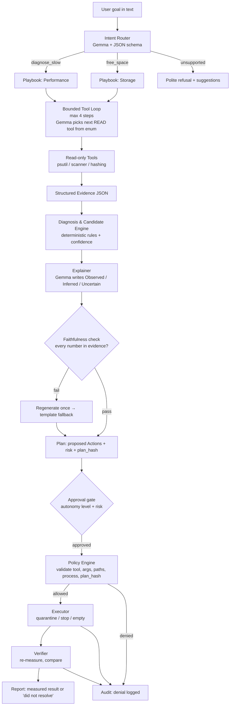
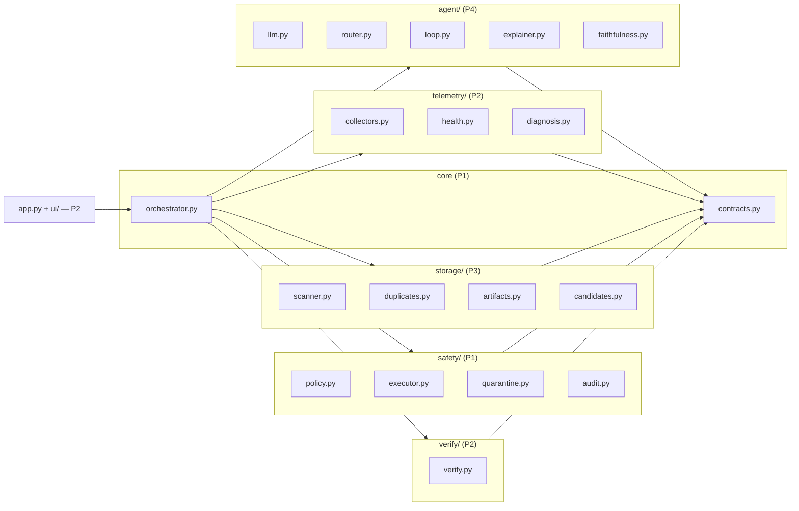

# PCSense Architecture

## Overview

PCSense is a local-first AI technician for Windows 11. It diagnoses performance problems, proposes safe remediation, and verifies every claim with measurements.

## Core Principle

> **Gemma reasons. Code acts. Measurements verify.**

The LLM (Gemma 4) handles intent routing, tool selection, and grounded explanations. All diagnosis rules, confidence scoring, policy enforcement, execution, and verification are deterministic code.

## System Architecture

## Module Map

## Safety Model

PCSense enforces safety through multiple layers:

### Layer 1: Scope Restriction
- Write actions are only allowed inside the **sandbox root** (`PCSENSE_SANDBOX`)
- The sandbox must contain a `.pcsense_sandbox` marker file (created by `tools/make_sandbox.py`)
- Real folders selected for analysis are **read-only**

### Layer 2: Policy Engine (`safety/policy.py`)
Every action passes **all** checks or is denied and logged:

1. **Tool validation** — Tool is in the registry; args validate against its pydantic model
2. **Path validation** — `realpath` → `normcase` → must be inside allowed write root
3. **Link detection** — Reject any path component that is a symlink, junction, or reparse point
4. **Protected denylist** — Drive roots, `C:\Windows`, `Program Files*`, `ProgramData`, user profile root, PCSense app dir, quarantine root
5. **Process validation** — PID owned by current user; not in protected process names
6. **Budget enforcement** — Max files and bytes per batch
7. **Plan-hash binding** — Approval is bound to a hash of the exact action list

### Layer 3: Untrusted Data Handling
- Filenames, process names, and log text are treated as **untrusted data**
- They appear in prompts only inside delimited data fields
- Even if the model is fooled, Layers 1–2 still apply

### Layer 4: Quarantine
- Deleted files are first moved to `PCSense_Quarantine/<batch_id>/` (reversible)
- A manifest (`manifest.json`) records original paths for restore
- "Empty Quarantine" permanently deletes — only inside the quarantine directory, always requires confirmation

### Layer 5: Verification
- Every action is followed by a before/after measurement
- If the metric didn't improve, PCSense reports "did not resolve" honestly
- Primary measurement = sandbox directory bytes (deterministic); secondary = drive free space (noisy)

## Autonomy Levels

| Level | Name | Behaviour |
|-------|------|-----------|
| 0 | **Observe** | Read tools only. Plans are shown but Execute is disabled |
| 1 | **Ask** *(default)* | Every action needs explicit approval |
| 2 | **Auto-low-risk** | LOW-risk quarantine inside sandbox runs automatically. MEDIUM/HIGH ask |

**Always ask, at every level:** `stop_process`, `empty_quarantine`, anything MEDIUM/HIGH.

## Risk Tiers

| Tier | Examples | Handling |
|------|----------|----------|
| LOW | `.tmp`, `*.log` old, `__pycache__`, caches | Auto at Level 2 (quarantine only) |
| MEDIUM | Duplicate files (keep one), dev artifacts | Ask |
| HIGH | Documents/Downloads not provably junk, unknown types, stopping processes | Ask, show warning |
